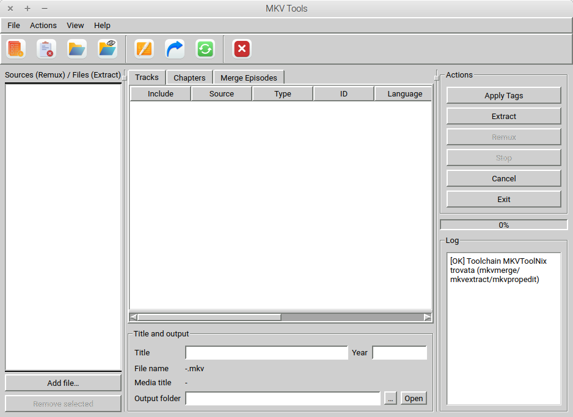
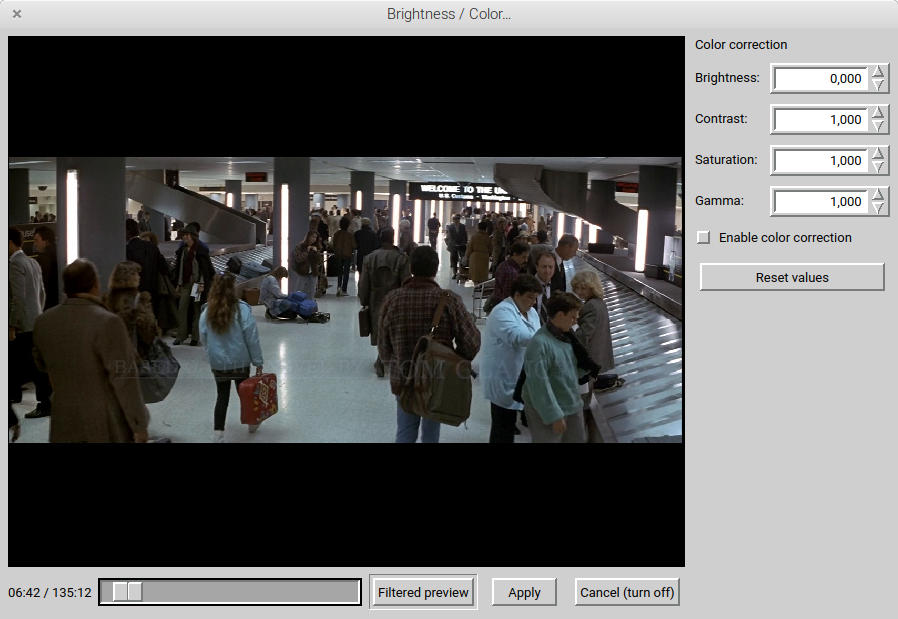
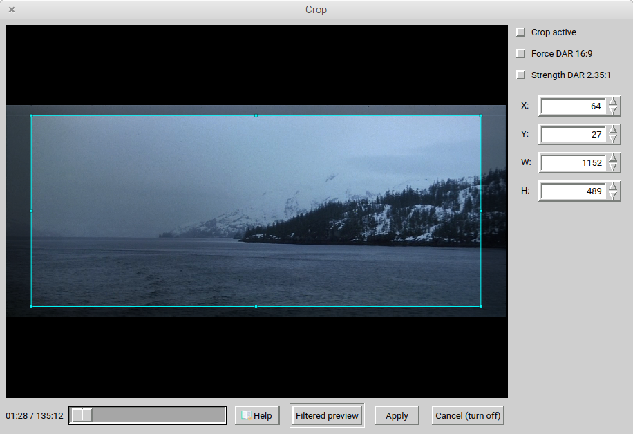
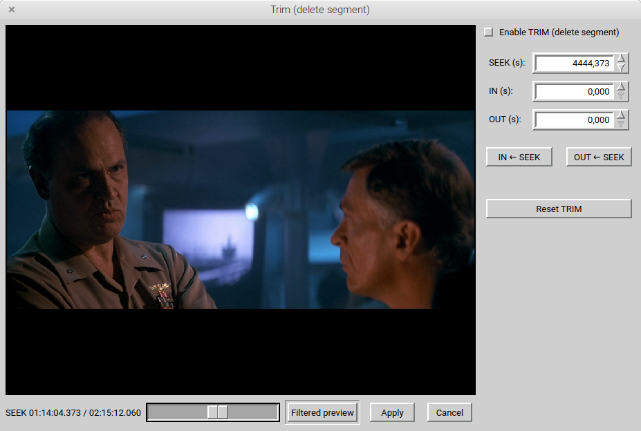
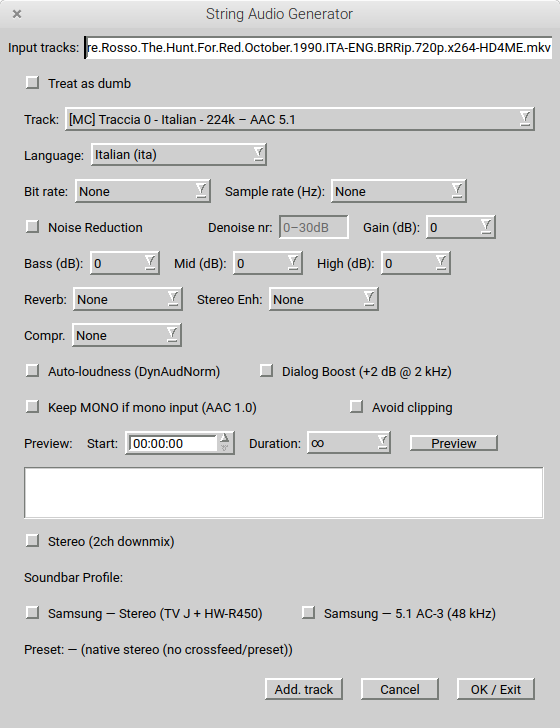

# HEVC – Video Converter v2.3.0.0

**All releases / Tutte le release:** https://github.com/Myname11959/Hevc-VideoConverter/releases  
**Changelog / Changelog:** https://github.com/Myname11959/Hevc-VideoConverter/releases

**Download (.deb Linux) + sorgenti (.tar.gz):** Ultima release → https://github.com/Myname11959/Hevc-VideoConverter/releases/latest  

**Qt/PyQt5 GUI for FFmpeg** → convert video to **HEVC/x265** with reproducible command lines, advanced audio profiles, preview, and an integrated **tool suite**:
**HEVC-GUI + MKV Suite + LDVD Ripper**.

**Languages / Lingue:** English — Italiano  
**Download (Linux .deb + Source .tar.gz):** https://github.com/Myname11959/Hevc-VideoConverter/releases  
**Donate:** https://paypal.me/loris1159

---

## Screenshots

  

---

## Highlights (EN)

- **Video**: CRF/preset or bitrate, stream mapping, crop/scale/filters, CFR/VFR, preview.
- **Audio**: ready profiles (Samsung Stereo / Samsung 5.1 AC-3), downmix, loudness, limiter, dialog boost, and guided audio preview.
- **Reproducible**: the app shows/uses clear FFmpeg command lines (easy to debug/share).
- **Suite**:
  - **MKV Suite (Tools → MKV Tools)**: Extract / Apply Tags / Remux / Merge Episodes / Auto-sync audio / Subtitle drift / Trim / Insert Clips.
  - **LDVD Ripper**: DVD → local files + (optional) subtitle OCR to SRT + handoff to HEVC.
  - **String Audio Generator (SAG)**: helper/builder for audio args, now with a separate **Noise Reduction** dialog with preview/analyze/apply workflow.

---

## Punti chiave (IT)

- **Video**: CRF/preset o bitrate, mapping stream, crop/scale/filtri, CFR/VFR, preview.
- **Audio**: profili pronti (Samsung Stereo / Samsung 5.1 AC-3), downmix, loudness, limiter, dialog boost e preview guidata.
- **Riproducibile**: comandi FFmpeg chiari (facili da condividere e debug).
- **Suite**:
  - **MKV Suite (Tools → Strumenti MKV)**: Estrai / Applica Tag / Crea MKV / Unisci episodi / Auto-sync audio / Subtitle drift / Trim / Insert Clips.
  - **LDVD Ripper**: DVD → file locale + (opzionale) OCR sottotitoli in SRT + handoff a HEVC.
  - **String Audio Generator (SAG)**: helper/builder per parametri audio, ora con dialog separato di **Noise Reduction** con preview/analisi/applica.

---

# MKV Suite — Quickstart (EN/IT)

**Where / Dove:**  
- EN: Tools → MKV Tools  
- IT: Tools → Strumenti MKV  

### What it does
- **Extract / Estrai**: export tracks from MKV (video/audio/subs) in their natural formats.
- **Apply Tags / Applica Tag**: set language, track name, default/forced flags (VLC-friendly).
- **Remux / Crea MKV**: build a new MKV from selected tracks (no conversion).
- **Merge Episodes / Unisci episodi**: join multiple episodes into one MKV (order = list order).
- **Auto-sync audio**: analyze and correct audio delay with Preview before the final remux.
- **Subtitle drift**: fix text subtitle drift when subtitles go more and more out of sync over time.
- **Trim**: cut unwanted parts such as commercials, intros, damaged sections, or credits; use precise cut with re-encode for accuracy, or fast cut without re-encode for speed.
- **Insert Clips**: insert one or more clips at chosen points inside a main video, keeping the inserted material visually consistent and avoiding stretched/squashed results.

### Output folder = “job dir” (important!)
MKV Suite uses ONE output folder per job, and creates:

    JOB_DIR/
      extract/
      chapters/
      remux/

**Beginner-proof workflow:**
1) Choose an empty output folder (job dir)  
2) Add source MKV(s)  
3) Check tracks/languages/flags  
4) Use one action at a time: Extract / Apply Tags / Remux / Merge Episodes / Trim / Insert Clips  
5) (Optional) Extract → edit subtitles/chapters → Remux  
6) For sync work: Analyze → Preview → small corrections → Remux  

### Chapters, subtitles, and prerequisites
- **Chapters**: manage them from the Chapters tab (save to `chapters/`, use them when remuxing).  
- **Subtitle editing (Linux)**: install **gnome-subtitles** to get a correct/clean subtitle edit workflow.  
- **MKV tools required**: install **mkvtoolnix** / **mkvtoolnix-gui** for the full MKV Suite workflow.

### SAG / Audio note
- **String Audio Generator (SAG)** now includes a separate **Noise Reduction** dialog with preview, analysis, and apply workflow, aligned with the main audio chain used for preview/final output.

---

# TL;DR — Install & Run

## Linux Mint / Ubuntu (primary target)

    sudo apt update
    sudo apt install -y \
      python3 python3-pyqt5 python3-pyqt5.qtmultimedia python3-pyqtgraph \
      python3-numpy python3-psutil python3-chardet ffmpeg git

    git clone https://github.com/Myname11959/Hevc-VideoConverter.git
    cd Hevc-VideoConverter
    python3 main.py

### Linux — Optional tools (recommended for the full suite)

    # MKV Suite tools + subtitle editor (Linux)
    sudo apt install -y mkvtoolnix mkvtoolnix-gui gnome-subtitles

## macOS 10.15+ (Intel / Apple Silicon incl. M1/M2/M3/M4, Sequoia)
Requires Homebrew.

    brew install python@3.11 ffmpeg
    python3 -m pip install -U pip setuptools wheel
    python3 -m pip install PyQt5 pyqtgraph numpy psutil chardet

    git clone https://github.com/Myname11959/Hevc-VideoConverter.git
    cd Hevc-VideoConverter
    python3 main.py

## macOS High Sierra 10.13 (Intel) (legacy)
Wheels may be older; try Python 3.8/3.9.

    /usr/bin/python3 -m pip install -U pip setuptools wheel
    /usr/bin/python3 -m pip install "PyQt5<5.16" pyqtgraph numpy psutil chardet

    git clone https://github.com/Myname11959/Hevc-VideoConverter.git
    cd Hevc-VideoConverter
    /usr/bin/python3 main.py

## Windows 10/11
- Install Python 3.10/3.11 (check “Add to PATH”)
- Install FFmpeg and add `...\ffmpeg\bin` to PATH

    py -m pip install --upgrade pip
    py -m pip install PyQt5 pyqtgraph numpy psutil chardet

    git clone https://github.com/Myname11959/Hevc-VideoConverter.git
    cd Hevc-VideoConverter
    py main.py

### Build a .deb (Ubuntu/Mint)

    bash tools/make_deb.sh
    # output: dist/hevc-video-converter_<version>_all.deb

### Source tar.gz (for other OS)

    # You can download the release tar.gz from Releases, or create one:
    bash tools/make_src_tarball.sh
    # output: dist/hevc-video-converter_<version>.tar.gz

---

## IMPORTANT (IT) — Subtitle Edit (snap) + dischi esterni /mnt

Se usi Subtitle Edit installato come snap:

    sudo snap connect subtitle-edit:alsa :alsa
    sudo snap connect subtitle-edit:removable-media :removable-media
    sudo snap connect subtitle-edit:mount-observe :mount-observe

---

## Legacy releases

- v2.1.0.0 → official EN+IT release  
- v2.0.0-6 → older legacy/Italian-only release (kept for reference)

---

## License

CC BY-NC 4.0 (Attribution-NonCommercial). See LICENSE.

