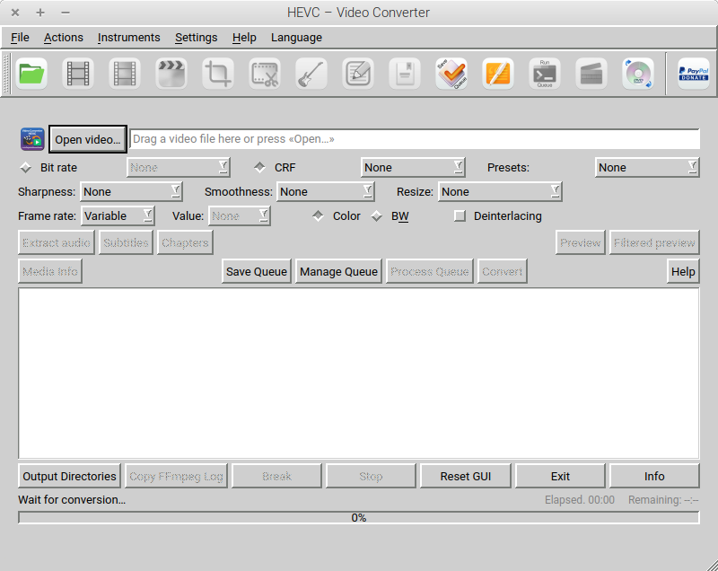
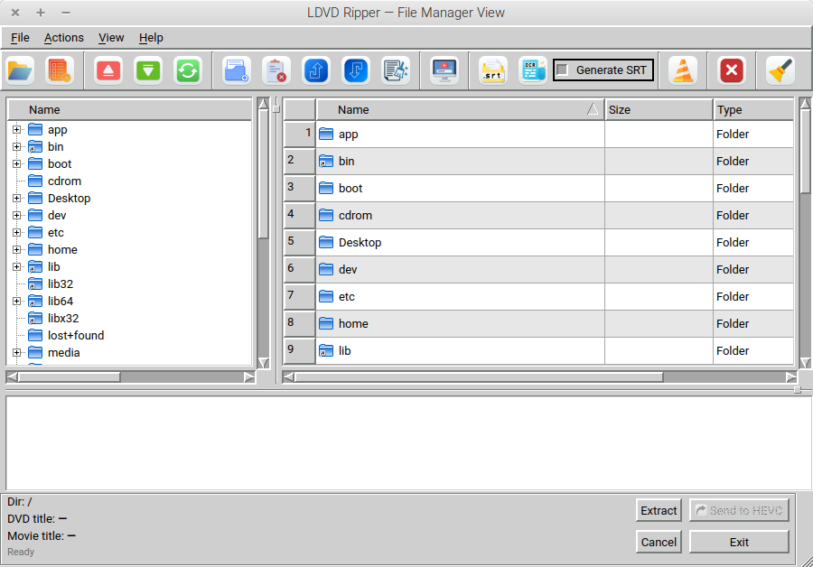

# HEVC – Video Converter

**All releases / Tutte le release:** https://github.com/Myname11959/Hevc-VideoConverter/releases  

**Download (.deb Linux) + sorgenti (.tar.gz):** Ultima release → https://github.com/Myname11959/Hevc-VideoConverter/releases/latest  


**Qt/PyQt5 GUI for FFmpeg** → convert video to **HEVC/x265** with reproducible command lines, advanced audio profiles, preview, and optional **LDVD Ripper** workflow.

**Languages / Lingue:** English — Italiano  
**Download (Linux .deb + Source .tar.gz):** https://github.com/Myname11959/Hevc-VideoConverter/releases  
**Donate:** https://paypal.me/loris1159

---

## Screenshots




---

## Highlights (EN)

- **Video**: CRF/preset or bitrate, stream mapping, crop/scale/filters, CFR/VFR, preview.
- **Audio**: ready profiles (Samsung Stereo / Samsung 5.1 AC-3), downmix, loudness, limiter, dialog boost.
- **Reproducible**: the app shows/uses clear FFmpeg command lines (easy to debug/share).
- **Suite**: HEVC-GUI + LDVD Ripper + String Audio Generator (builder for audio args).

---

## Punti chiave (IT)

- **Video**: CRF/preset o bitrate, mapping stream, crop/scale/filtri, CFR/VFR, preview.
- **Audio**: profili pronti (Samsung Stereo / Samsung 5.1 AC-3), downmix, loudness, limiter, dialog boost.
- **Riproducibile**: comandi FFmpeg chiari (facili da condividere e debug).
- **Suite**: HEVC-GUI + LDVD Ripper + String Audio Generator (builder parametri audio).

---

# TL;DR — Install & Run

## Linux Mint / Ubuntu (primary target)
```bash
sudo apt update
sudo apt install -y \
  python3 python3-pyqt5 python3-pyqt5.qtmultimedia python3-pyqtgraph \
  python3-numpy python3-psutil python3-chardet ffmpeg git

git clone https://github.com/Myname11959/Hevc-VideoConverter.git
cd Hevc-VideoConverter
python3 main.py

## macOS 10.15+ (Intel / Apple Silicon incl. M1/M2/M3/M4, Sequoia)
Requires Homebrew.

brew install python@3.11 ffmpeg
python3 -m pip install -U pip setuptools wheel
python3 -m pip install PyQt5 pyqtgraph numpy psutil chardet

git clone https://github.com/Myname11959/Hevc-VideoConverter.git
cd Hevc-VideoConverter
python3 main.py

## macOS High Sierra 10.13 (Intel) (legacy)
Wheels may be older; try Python 3.8/3.9.

/usr/bin/python3 -m pip install -U pip setuptools wheel
/usr/bin/python3 -m pip install "PyQt5<5.16" pyqtgraph numpy psutil chardet

git clone https://github.com/Myname11959/Hevc-VideoConverter.git
cd Hevc-VideoConverter
/usr/bin/python3 main.py

## Windows 10/11
Install Python 3.10/3.11 (check “Add to PATH”)
Install FFmpeg and add ...\ffmpeg\bin to PATH

py -m pip install --upgrade pip
py -m pip install PyQt5 pyqtgraph numpy psutil chardet

git clone https://github.com/Myname11959/Hevc-VideoConverter.git
cd Hevc-VideoConverter
py main.py

Build a .deb (Ubuntu/Mint)
bash tools/make_deb.sh
# output: dist/hevc-video-converter_<version>_all.deb

Source tar.gz (for other OS)

You can download the release tar.gz from Releases, or create one:

bash tools/make_src_tarball.sh
# output: dist/hevc-video-converter_<version>.tar.gz

IMPORTANT (IT) — Subtitle Edit (snap) + dischi esterni /mnt

Se usi Subtitle Edit installato come snap:

sudo snap connect subtitle-edit:alsa :alsa
sudo snap connect subtitle-edit:removable-media :removable-media
sudo snap connect subtitle-edit:mount-observe :mount-observe

Legacy releases

v2.1.0.0 → official EN+IT release

v2.0.0-6 → older legacy/Italian-only release (kept for reference)

License
CC BY-NC 4.0 (Attribution-NonCommercial). See LICENSE.
